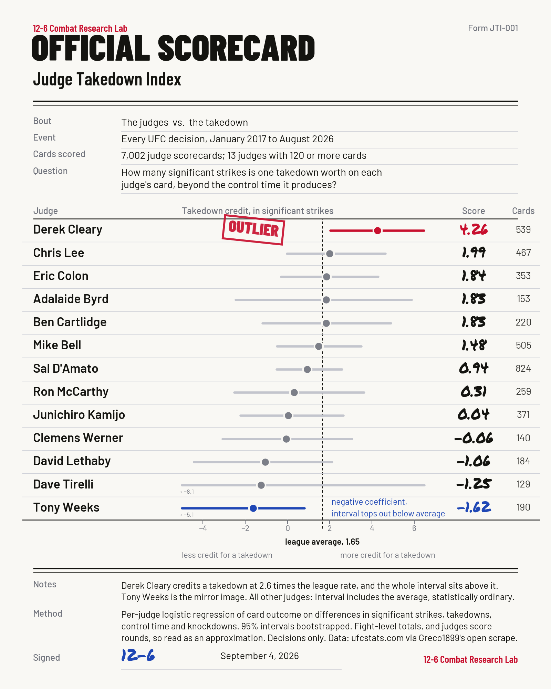

# Judge Takedown Index

How many significant strikes is one takedown worth on each UFC judge's scorecard, beyond the control time it produces?

Every UFC decision from January 2017 to August 2026. 7,002 judge scorecards. 13 judges with 120 or more cards.



## Results

League average: one takedown is worth about 1.65 significant strikes of credit, holding control time constant.

| Judge | Cards | Strikes per takedown | 95% interval | vs league |
|---|---|---|---|---|
| Derek Cleary | 539 | 4.26 | 2.02 to 6.46 | 2.58x |
| Chris Lee | 467 | 1.99 | -0.02 to 4.64 | 1.21x |
| Eric Colon | 353 | 1.84 | -0.31 to 4.29 | 1.12x |
| Adalaide Byrd | 153 | 1.83 | -2.45 to 5.87 | 1.11x |
| Ben Cartlidge | 220 | 1.83 | -1.19 to 4.89 | 1.11x |
| Mike Bell | 505 | 1.48 | -0.50 to 3.50 | 0.90x |
| Sal D'Amato | 824 | 0.94 | -0.52 to 2.58 | 0.57x |
| Ron McCarthy | 259 | 0.31 | -2.52 to 3.63 | 0.19x |
| Junichiro Kamijo | 371 | 0.04 | -2.23 to 2.65 | 0.02x |
| Clemens Werner | 140 | -0.06 | -3.08 to 3.06 | -0.04x |
| David Lethaby | 184 | -1.06 | -4.43 to 2.11 | -0.64x |
| Dave Tirelli | 129 | -1.25 | -8.09 to 6.48 | -0.76x |
| Tony Weeks | 190 | -1.62 | -5.10 to 0.81 | -0.98x |

Derek Cleary is the only judge whose interval sits entirely above the league average. Tony Weeks is the only judge whose interval sits entirely below it. Every other judge is statistically indistinguishable from the average.

The ranking held up in a second specification that dropped control time from the model. Cleary stayed first and Weeks stayed last.

## Run it

```
pip install -r requirements.txt
python build_dataset.py
python run_regression.py
python make_scorecard.py
```

The first script downloads three public CSVs from the ufcstats scrape linked below (about 11 MB). Everything runs in under two minutes on a laptop. Results land in `results/`.

## Method

For every decision, ufcstats lists each judge's name and final score. Those scores are parsed and matched to the fight's total significant strikes, takedowns, control time and knockdowns for both fighters.

For each judge with at least 120 cards, a logistic regression models the probability that the judge scored the fight for fighter A as a function of the differences in those four stats. The takedown coefficient divided by the significant strike coefficient gives an exchange rate: how many significant strikes one takedown is worth on that judge's card, holding control time constant.

Confidence intervals come from 400 bootstrap resamples of each judge's cards. A judge is flagged only if the whole interval clears the league average.

## Caveats

- Judges score rounds. This model uses fight totals, so it is an approximation of round by round scoring.
- Decisions only. Fights that ended in a finish have no scorecards.
- Takedowns and control time are correlated. Control time stays in the model on purpose, so the takedown number reads as credit for the takedown itself beyond the control it produced.
- Small samples produce wide intervals. Judges with fewer than 120 cards are excluded, and most of the judges who are included cannot be separated from the average.

## Data

Fight and scorecard data comes from ufcstats.com through the open scrape maintained at [Greco1899/scrape_ufc_stats](https://github.com/Greco1899/scrape_ufc_stats). Fonts in the graphic are Barlow and Permanent Marker, downloaded at runtime from the Google Fonts repository.

## About

12-6 Combat Research Lab works at the intersection of fight data, statistics and machine learning. This is the first public drop.

## License

MIT
